# Robot Pembersih Panel Surya Otonom

Implementasi *Two-Stage Detection* YOLOv11 dan Kendali PID pada Sistem Robot Pembersih Panel Surya Otonom Berbasis Klasifikasi Tingkat Kekotoran.

**Tugas Akhir D4 Teknologi Rekayasa Instrumentasi dan Kontrol**
Universitas Gadjah Mada — 2026
Penyusun: Muhammad Ridho Assidiqi (22/505759/SV/21913)
Pembimbing: Dr. Ir. Atikah Surriani, S.T., M.Eng., IPM.

---

## Tampilan Alat

<p align="center">
  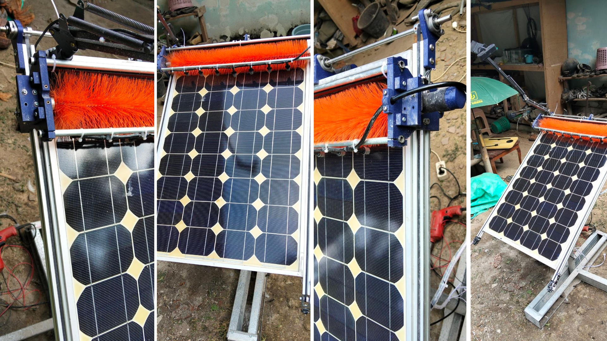
</p>

<p align="center">
  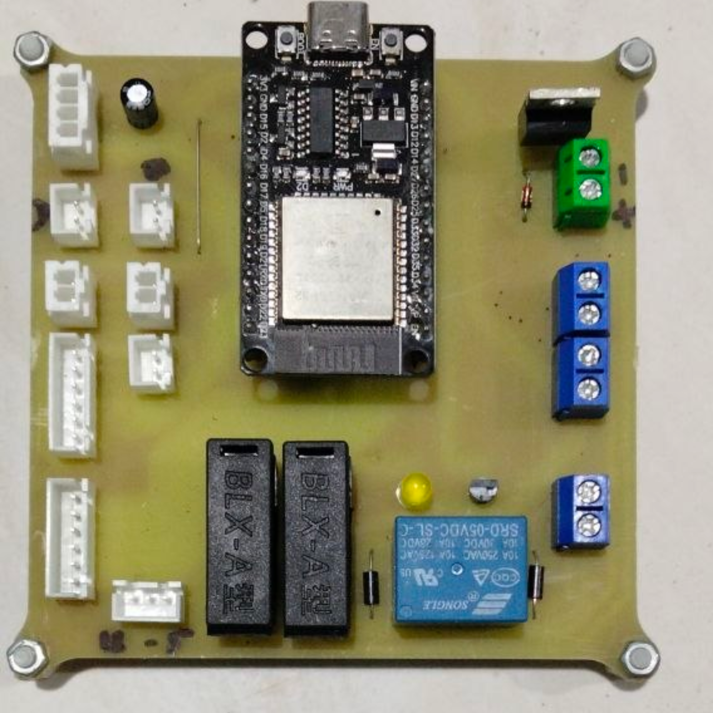
</p>

---

## Kondisi Panel — Sebelum & Sesudah Pembersihan

<table align="center">
  <tr>
    <th>Level</th>
    <th>Sebelum</th>
    <th>Sesudah</th>
  </tr>
  <tr>
    <td align="center"><b>Bersih</b></td>
    <td align="center">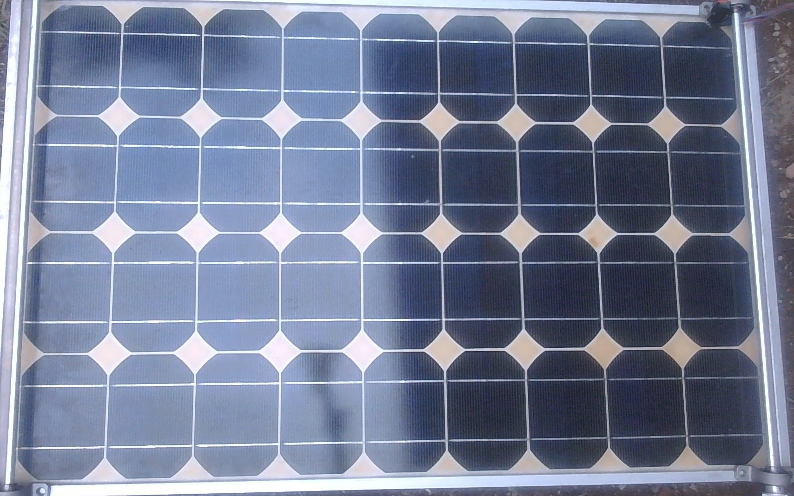</td>
    <td align="center">—</td>
  </tr>
  <tr>
    <td align="center"><b>Ringan</b></td>
    <td align="center">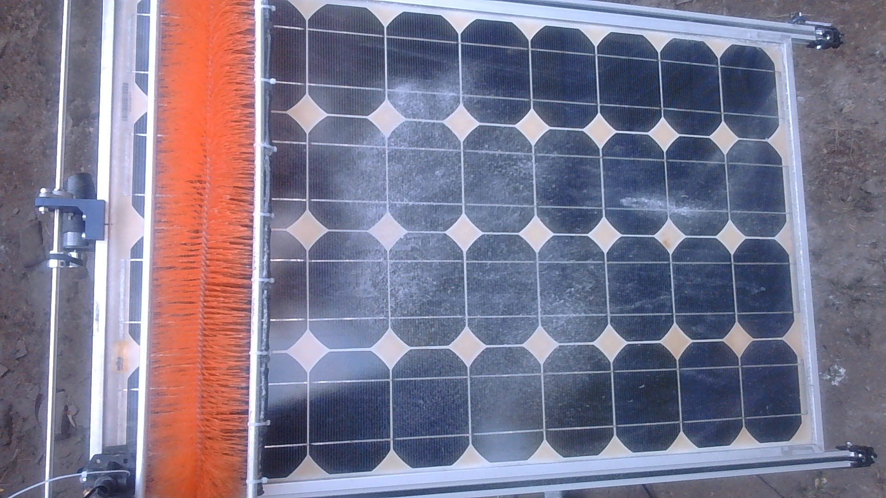</td>
    <td align="center">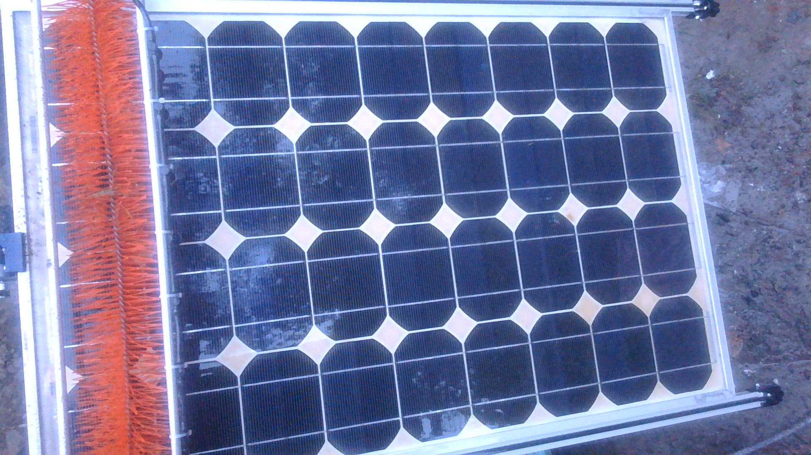</td>
  </tr>
  <tr>
    <td align="center"><b>Sedang</b></td>
    <td align="center">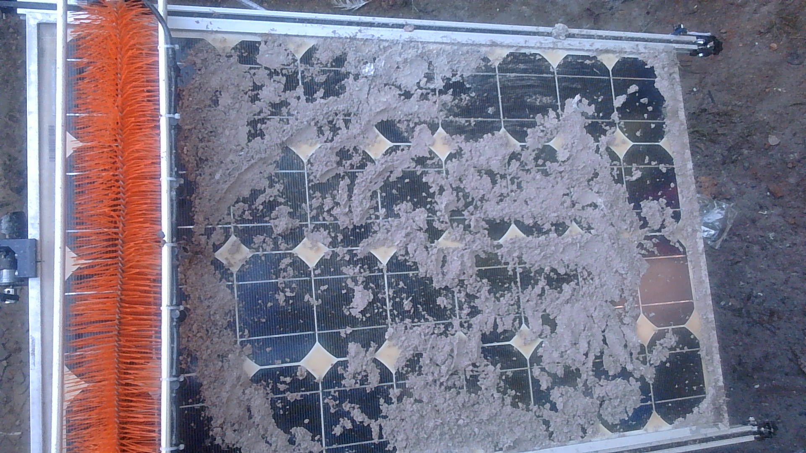</td>
    <td align="center">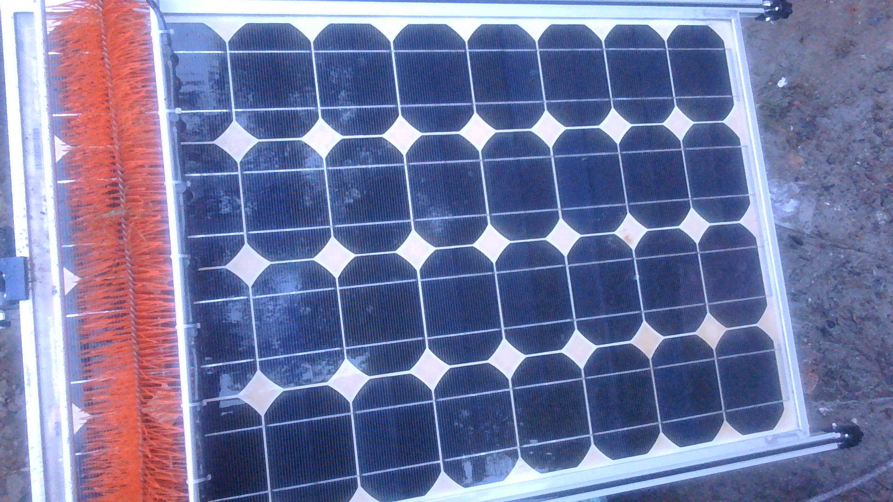</td>
  </tr>
  <tr>
    <td align="center"><b>Berat</b></td>
    <td align="center">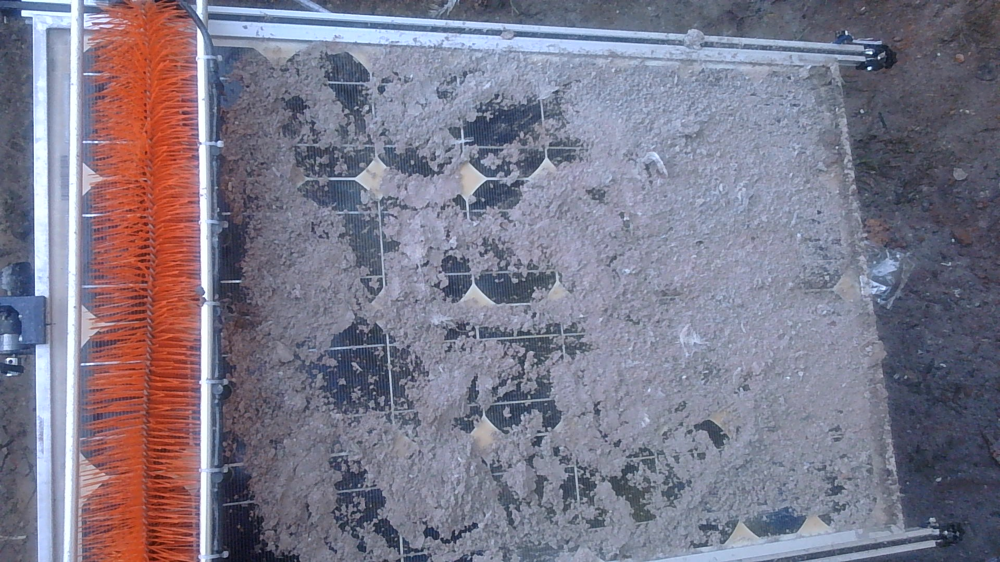</td>
    <td align="center">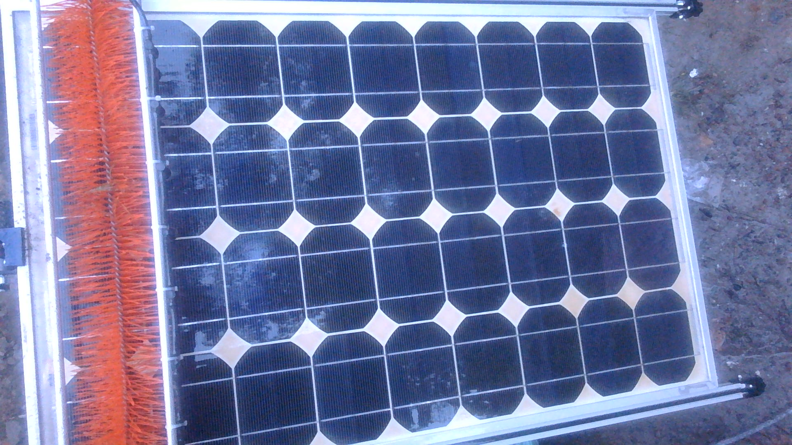</td>
  </tr>
</table>

---

## Arsitektur Sistem

<p align="center">
  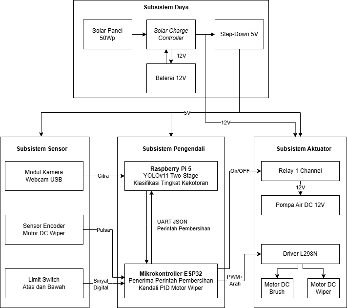
</p>

```
Raspberry Pi 5                        ESP32
┌─────────────────────┐              ┌──────────────────────┐
│  Kamera → YOLOv11   │   UART JSON  │  FSM → PID → Motor   │
│  Two-Stage Pipeline  │ ──────────► │  Wiper / Brush / Pump│
│  Flask Web Interface │ ◄────────── │  Encoder Feedback    │
└─────────────────────┘              └──────────────────────┘
```

---

## Antarmuka Web

<p align="center">
  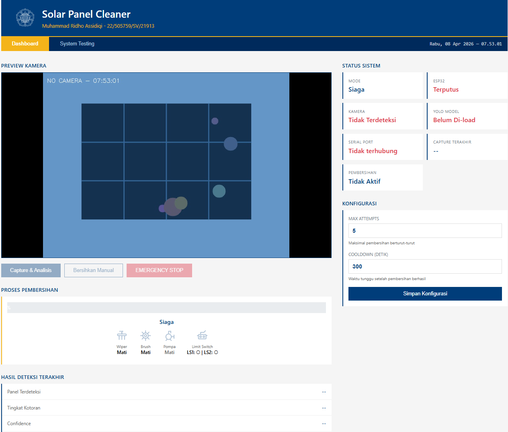
  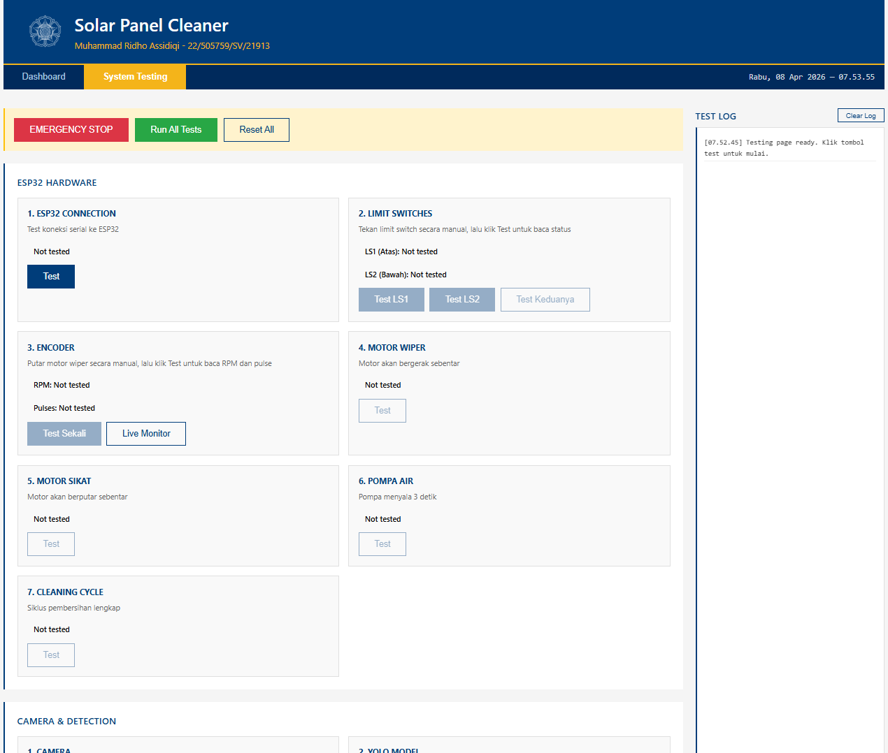
</p>

---

## Hasil Pengujian

### Model YOLOv11 — Confusion Matrix Klasifikasi

<p align="center">
  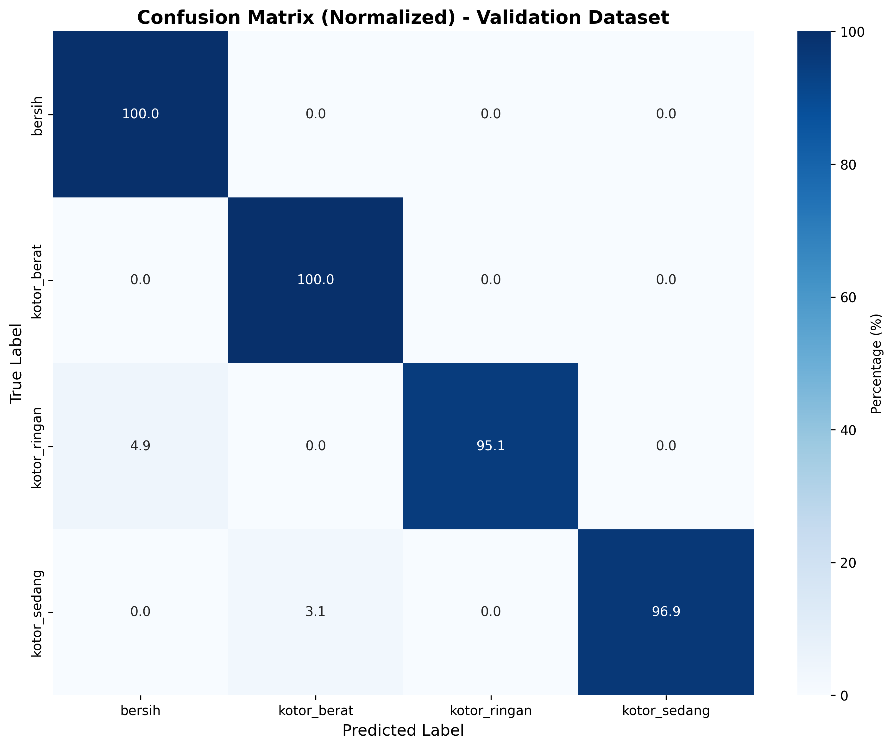
</p>

### Kendali PID — Open-Loop vs Closed-Loop

<p align="center">
  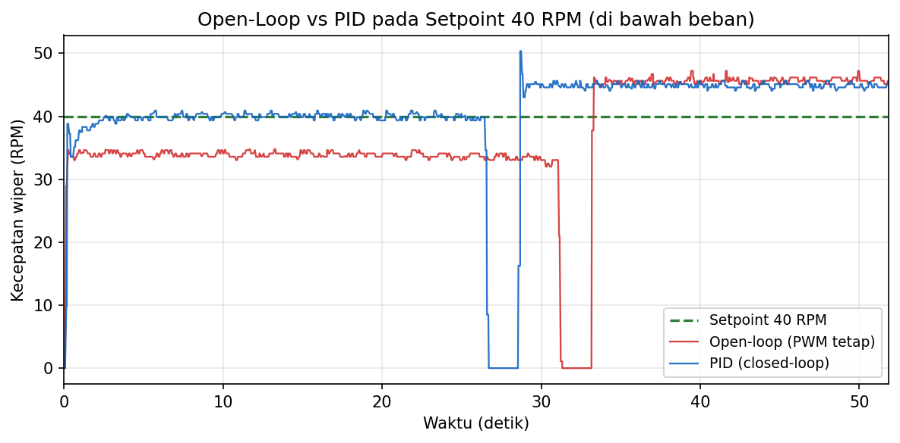
</p>

### Respons Step PID (Setpoint 30 RPM)

<p align="center">
  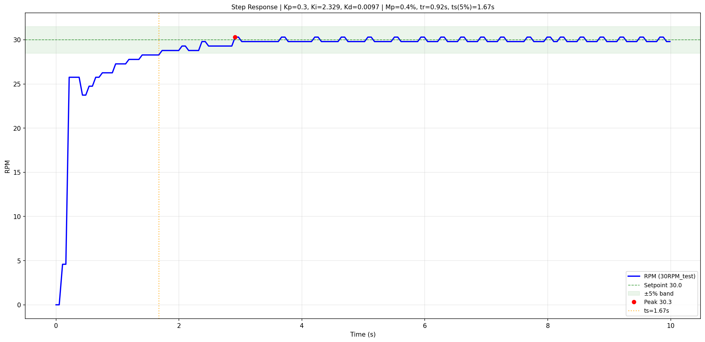
</p>

### Ringkasan Metrik

| Metrik | Nilai |
|--------|-------|
| mAP@0.5 deteksi panel | 99,43% |
| Akurasi klasifikasi kekotoran | 98,00% |
| Kecepatan inferensi (RPi 5) | 2,02 FPS (494,77 ms) |
| Overshoot PID motor wiper | < 10% |
| Success rate komunikasi serial | 100% (100/100 perintah) |
| Success rate monitoring otonom | 93,33% (14/15 sesi) |

---

## Struktur Repositori

```
├── esp32/          # Firmware ESP32 (PlatformIO) — FSM, PID, komunikasi serial
└── raspberry-pi/   # Aplikasi Raspberry Pi 5 (Python/Flask) — vision, web interface
```

---

## Instalasi

### ESP32

```bash
cd esp32
pio run --target upload --environment production
```

### Raspberry Pi 5

```bash
cd raspberry-pi
pip install -r requirements.txt
cp .env.example .env        # sesuaikan konfigurasi
python main.py
```

> **Catatan model:** File bobot YOLOv11 (`.pt`) tidak disertakan karena ukurannya besar. Tempatkan secara manual di `raspberry-pi/models/` sesuai `models/README.md`.
